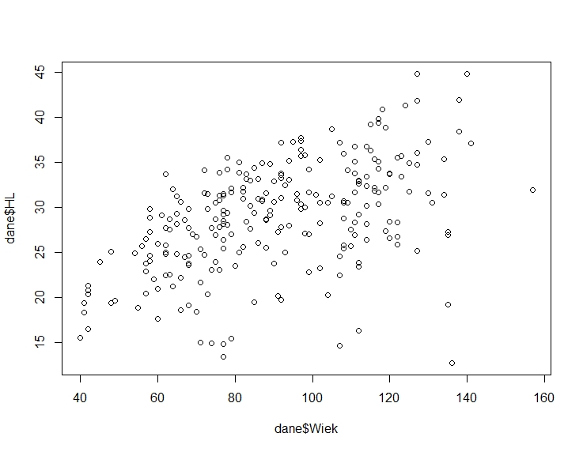

```{r setup, include=FALSE}
knitr::opts_chunk$set(echo = TRUE)
```


## Wprowadzenie

**R** – język programowania; środowisko do obliczeń statystycznych i wizualizacji (nie tylko). Oprogramowanie R jest projektem GNU opartym o licencję GNU GPL, jest więc zupełnie darmowy zarówno do zastosowań edukacyjnych jak i biznesowych.

**Rstudio** - najpopularniejszy edytor do języka R. 

Instalacja i inne bardzo przydatne informacje można znaleźć w wielu tutorialach dostępnych online. Np. Przemysław Biecek [Przewodnik po pakiecie R](http://biecek.pl/r/przewodnikpopakiecierwydanieiiiinternet.pdf). 

RStudio składa się z kilku podokien i narzędzi: 

*	Konsola (*Console*) – tutaj możesz wpisywać bezpośrednio kod, 

*	Okno środowiska (*Environment*) – wyświetlane tu są wszystkie zapisane w pamięci zmienne, jak i funkcje. Środowisko można zapisać, jak również wczytać. Używając tego okna można również importować dane z zewnątrz oraz przejrzeć historię wpisywanych linii kodu. 

*	Okno z zakładkami – tutaj możemy przeglądać strukturę plików na dysku (*Files*), wyświetlać wykresy (*Plots*), przeglądać zainstalowane pakietu (*Packages*), szukać pomocy na temat funkcji z pakietów (*Help*). 

*	W R najczęściej chcemy pisać skrypty składające się z wielu linii, które następnie będziemy wykonywać. Do otwarcia nowego skryptu służy ikona Add R Script lub kombinacja klawiszy Ctrl+Shift+N. 


Funkcje – zazwyczaj skonstruowane w sposób:

nazwa_funkcji(x, y, …)

* x – dane wejściowe
* y – dalsze argumenty, które mogą być 
Na przykład w funkcji [`read.csv()`](https://stat.ethz.ch/R-manual/R-devel/library/utils/html/read.table.html), która służy do wczytywania danych w formacie csv:

```read.csv(file, header = TRUE, sep = ",", quote = "\"", dec = ".", fill = TRUE, comment.char = "", ...)```

Wynik działania danej funkcji możemy przypisać do zmiennej:
	`dane = read.csv(…)`

Typy obiektów w R:

*	Wektory 
*	Tekst
*	Macierze
*	Listy
*	Ramki danych (**data frames**)

*Wektory* - to najprostszy rodzaj struktury danych w R. 

  `wektor = c(10, 12, 16, -4, 3, 17, -1, 5, 12, 4)`

*Ramki danych* 
Wczytywanie bazy danych - najczęściej w formacie .csv > obiekt typu data frame
Po wczytaniu danych warto sprawdzić czy wszystko z nimi w porządku, np. uzywając str() lub summary()
  
  `str(dane)`
  `summary(dane)`

Po wywołaniu fukncji str() zobaczymy strukturę każdej z kolumn. Pamiętaj, że aby przeprowadzac dalsze przetowrzenia na liczbach odpowiednie kolumny muszą mięć odpowiednie formaty liczbowe - czyli **int** lub **num**
Dostęp do poszczególne kolumn - możemy użyć znaku $ czyli:

  `dane$nachylenie` 
  
lub kwadratowcyh nawiasów:
  
  `dane[,4]`

Aby wywołac jakąś konkretną wartość z data frame możemy wpisać:

  `dane[9,17]` gdzie w tym przypadku 9 to numer rzędu a 17 kolumny

***  
Pakiety – instalacja i wczytywanie
W R dostępnych jest wiele funkcji „bazowych”, jedną z nich jest `read.csv()`. Istenieje jednak wiele dodatkowych pakietów zawierających fukkcje bardziej złożone i służące określonym zadaniom. Aby wykorzystać funkcje z jakiegoś pakietu należy najpierw go zainstalować (raz), następnie wczytać (każdorazowo przy nowym projekcie). Służą do tego funkcje:

`install.packages(„nazwa_pakietu”)`

`library(nazwa_pakietu)`

Instalować pakiety można również wchodząc w zakładkę Packages.

Pomoc na temat danej funkcji możemy uzyskac wpisując: 

  `?nazwa_funkcji`

*** 
## Analizy statystyczne w R

* Korelacja
* Regresja, modele regresji
* Prosta regresja liniowa
* Regresja wieloraka

###Statystyki opisowe
Statystyki takie jak średnia, minimum, odchylenie standardowe, mediana... dla danej zmienniej uzyskamy poprzez wpisanie:

  `mean()`
  
  `min()`
  
  `std()`
  
  `median()`
  
**Uwaga!** jeżeli w danych danych mamy wartości puste - w R oznaczane jako **NA** (Not Available) wynikiem wyżej wymienionych operacji również będzie NA. Aby policzyć statystyki dla wartości, które nie są NA nalezy dodać argument `na.rm = TRUE` np.:

  `mean(dane$TPI200, na.rm = TRUE)`
  
###Proste wykresy

Proste wykresy mozna tworzyć za pomocą funckji `plot()`

Spróbuj utworzyć wykres zależności wysokości (HL) od wieku drzew oraz Site Indexu (SI) od wysokości n.p.m.


Inne przydatne funkcje do wykresów to:

* Wykres rozrzutu z krzywą `scatter.smooth()`

* Wykres ramka-wąsy `box.plot()`

* Histogram `hist()`

* Wykres gęstości `plot(density())`

* Macierz wykresów rozrzutu `pairs()`

Wygeneruj kilka z wyżej wymienionych typów wykresów dla wybranych zmiennych.


###Korelacja
Do obliczenia korelacji między zmiennymi możemy użyć funkcji `cor()`. Domyślnie mierzy ona korelacje Pearsona.

Wywołując pomoc dla funkcji `cor()` sprawdź jakie miary korelacji są dostępne.

Korelację obliczymy tylko dla danych liczbowych - dlatego przed jej obliczeniem wyodrębnimy cześć naszego data frame.

W tym celu wykorzystamy nawiasy kwadratowe.

Utwórz nowy obiekt _dane_subset_, który będzie zawierał kolumny 3, 4 i od 9 do 13, następnie oblicz macierz korelacji.

Macierz korelacji możemy zwizualizować za pomocą funkcji `corrplot()` z pakietu **corrplot**

Zainstaluj i wczytaj powyższy pakiet a następnie zwizualizuj macierz korelacji. 


Do obliczenia istotności korelacji służy funkcja `cor.test()`

Ciekawe narzędzia do wizualizacji korelacji dostępne są w pakiecie `corrplot`. Zanistaluj i wczytaj pakiet a następnie użyj funkcji `corrplot()` do wizualizacji wcześniej obliczonej macierzy korelacji.


###Regresja liniowa

Do obliczenia modelu regresji liniowej służy funkcja `lm()`. 
Formułę modelu podajemy w postaci: Y ~ X1 + X2 + ...

Oblicz model regresji liniowej - jako zmienną objaśnianą wybierz Wysokość a jako objaśniającą Wiek. Zapisz model jako obiekt _model1_ i wywołaj go - pojawią się współczynniki a i b czyli równanie regresji.
Sprawdź inne parametry modelu poprzez zastosowanie funkcji `summary()`

W podsumowaniu modelu znajdziemy między innymi wartość p (przedostatnia kolumna) oraz współczynnik determinacji R2.

Funkcja `predict()` pozwala na obliczenie predykowanych wartości.

###Regresja nieliniowa

Wykorzystamy zmienne wysokości NPM i SI w regresji wielomianowej (_polynomial_), która ma postać:

  `lm(Y ~ poly(X,i))`, gdzie _i_ to stopień wielomianu 

***

## Wizualizacje w R

Do bardziej zaawansowanych wizualizacji w R możemy wykorzystać pakiet `ggplot2`

Zainstaluj i wczytaj pakiet `ggplot2`

Funkcja `ggplot` charakteryzje się określoną składnią, którą na bieżąco można ulepszać (tzn. dodawać coraz więcej warstw, motwywów do już istniejącego wykresu). Spróbujmy stworzyć "bazę" pod nasz wykres:

  `ggplot(dane, aes(x,y))`

  aes - czyli _aesthetics_ określa które zmienne będą na osi X i osi y

Stwórz bazę pod nasz wykres (na początk punktowy - scatterplot) - wybierz zmienne NPM i SI.

Utworzony wykres, mimo iż wybraliśmy zmienne jest pusty. Aby coś się na nim pojawiło należy sprecyzować czy wykres ma być punktowy, liniowy itd.
Kolejne elementy, w tym określenie typu geometrii wykresu będziemy dodawać używając znaku **+**

  `ggplot(dane, aes(x,y))+
    geom_point()`

Inne typy geometrii: `geom_line()`, `geom_smooth()`, `geom_boxplot()` ... 

Dodaj do istniejącego wykresu krzywą używając `geom_smooth(se = 0)`. Argument se pokazuje (lub w tym przypadku nie) przedziały ufnośći.

Aby zmienić zakres osi x i y uzywamy odpowiednio (również używając znaku +): `xlim(min,max)` i `ylim(min,max)`.

Tytuły wykresu i osi x i y: `labs(title = , x =, y= )`

Kolory możemy ustawić w sposób "statyczny" lub przypisać np. odmienne kolory lub rozmiar w zależności od wartości jakiejś zmiennej:


